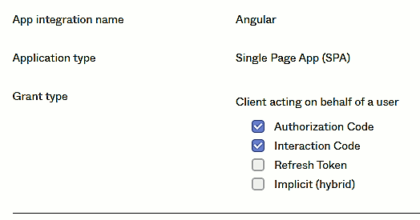
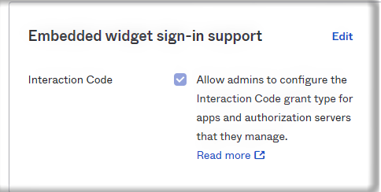
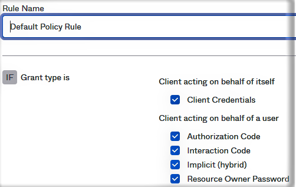

# Angular + Okta Sign-In Widget Example 
 
This example app shows how to use Okta's Sign-In Widget in an Angular app.

Please read [Build an Angular App with Okta's Sign-In Widget in 15 Minutes](https://developer.okta.com/blog/2017/03/27/angular-okta-sign-in-widget) to see how this app was created.

**Prerequisites:** [Node.js](https://nodejs.org/).

*[Okta](https://developer.okta.com/) has Authentication and User Management APIs that reduce development time with instant-on, scalable user infrastructure. Okta's intuitive API and expert support make it easy for developers to authenticate, manage and secure users and roles in any application.*

* [Getting Started](#getting-started)
* [Links](#links)
* [Help](#help)
* [License](#license)

## Getting Started

To install this example application, run the following commands:

```bash
git clone https://github.com/oktadeveloper/okta-angular-sign-in-widget-example.git
cd okta-angular-sign-in-widget-example
npm install
```

This will get a copy of the project installed locally, install all of its dependencies and start the app.

### Create an OIDC App in Okta

You will need to [create an OIDC App in Okta](https://developer.okta.com/blog/2017/03/27/angular-okta-sign-in-widget#create-an-openid-connect-app-in-okta) to get your values to perform authentication. 

OpenID Connect is built on top of the OAuth 2.0 protocol. It allows clients to verify the identity of the user and, as well as to obtain their basic profile information. To learn more, see [http://openid.net/connect](http://openid.net/connect/).

Login to your Okta account, or [create one](https://developer.okta.com/signup/) if you don't have one. Navigate to **Applications** and click on the **Add Application** button. Select **SPA** and click **Next**. On the next page, specify `http://localhost:4200` as a Base URI, Login redirect URI, and Logout redirect URI. Click **Done** and copy the generated `Client ID`.

In `src/app/shared/okta/okta.service.ts`, set the `baseUrl` and paste your `clientId`.

```typescript
this.widget = new OktaSignIn({
  baseUrl: 'https://{yourOktaDomain}',
  clientId: '{clientId}',
  redirectUri: 'http://localhost:4200'
});
```

**TIP:** The value of `{yourOktaDomain}` should be something like `dev-123456.okta.com`. Make sure you don't include `-admin` in the value!

After making these changes, you should be able to start the app (with `ng serve`) and log in with your credentials at `http://localhost:4200`.

## Links

This example uses the following libraries provided by Okta:

* [Okta Sign-In Widget](https://github.com/okta/okta-signin-widget)

## Help

Please post any questions as comments on the [blog post](https://developer.okta.com/blog/2017/03/27/angular-okta-sign-in-widget), or visit our [Okta Developer Forums](https://devforum.okta.com/). You can also email developers@okta.com if would like to create a support ticket.

## License

Apache 2.0, see [LICENSE](LICENSE).


## Things to note with Angular 14 version or greater.

 1. Enable interaction code flow in okta spa application.

 2. If there is no interaction code flow in your okta identity engine, enable it in settings/Account.
 
 3. And enable interaction code flow in authorization server access policies.

 4. You are good to go🥳